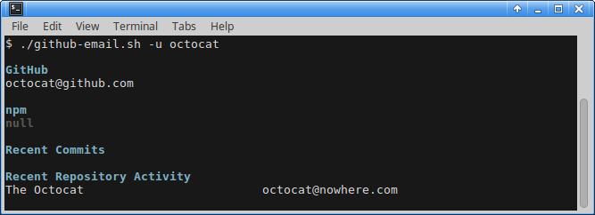

# github-email

This script retrieves a user's email address from various sources,
including: GitHub, GitHub commits, GitHub repository activity, and NPM.



# Requirements

Install the following software packages:

* [jq](https://stedolan.github.io/jq/download/)

# Installation

Install the script using any method described in this section.

## npm

Install the script using [npm](https://www.npmjs.com/) as follows:

```sh
npm install --global github-email
```

## wget

Install the script for the local account as follows:

```sh
mkdir -p $HOME/bin
cd $HOME/bin
wget https://raw.githubusercontent.com/paulirish/github-email/master/github-email.sh
chmod +x github-email.sh
```

# Authenication Token

If the `GITHUB_TOKEN` environment variable is not set, the script will ask
the user to generate an authenicated API token and use it. Generate an
[authenticated API](https://git.io/vxctz) token as follows:

1. Visit https://github.com/settings/tokens/new?description=github-email
1. Click __Generate Token__.
1. Copy the token.
1. Run the script.
1. Follow the instructions.

This will save a copy of the token in `$HOME/.ghtoken`.

